# Expedition 33 alike


# Proyecto Integrador 3.8: Juego de Aventura con Patrones de Diseño

## Propósito del Proyecto

Este proyecto consiste en el desarrollo de un juego de aventura básico basado en turnos atraves del texto (Me inspire jugando expedition 33). El objetivo principal no es solo crear un juego entretenido, sino consolidar la comprensión y aplicación práctica de diversos patrones de diseño de software. A través de la implementación de mecánicas de juego como la creación de personajes, combate, uso de habilidades y equipamiento, se demuestran las ventajas y soluciones que ofrecen estos patrones a problemas comunes de diseño en el desarrollo de software.

## Tecnología Utilizada

* **Lenguaje de Programación:** Python 3.11

## Estructura del Proyecto

El código fuente del juego se organiza dentro del paquete `game`, que contiene los siguientes módulos principales:

* `characters.py`: Define las clases para los personajes (jugador y enemigos).
* `items.py`: Define las armas, armaduras y el sistema de encantamientos (Decorador).
* `strategies.py`: Define las diferentes estrategias de combate para los personajes.
* `factories.py`: Define las fábricas para la creación de personajes y su equipo.
* `commands.py`: Define los comandos para las acciones del jugador.
* `constants.py`: Almacena constantes utilizadas a lo largo del juego.
* `main.py`: Contiene el bucle principal del juego y la lógica de interacción con el usuario.

## Patrones de Diseño Implementados

Se han implementado los siguientes cuatro patrones de diseño, cumpliendo con los requisitos de un patrón creacional, uno estructural, uno de comportamiento y uno adicional:

### 1. Patrón Creacional: `Abstract Factory` (Fábrica Abstracta)

* **Problema de Diseño:**
    Se necesitaba una forma de crear familias de objetos relacionados, específicamente, diferentes tipos de personajes (Guerrero, Mago, Pícaro) junto con su equipamiento inicial característico (arma y armadura apropiadas para su clase). Era importante que el código cliente (por ejemplo, el módulo de creación de personaje) no estuviera fuertemente acoplado a las clases concretas de cada pieza de equipo o personaje, y que se pudiera asegurar la coherencia del conjunto creado (un Mago siempre recibe una Vara y una Túnica, no una Espada). Además, se buscaba facilitar la adición de nuevas clases de personajes en el futuro.

* **Razón de la Elección:**
    El patrón `Abstract Factory` es ideal para esta situación porque proporciona una interfaz para crear familias de objetos relacionados o dependientes sin especificar sus clases concretas. Permite que el cliente utilice la fábrica abstracta para crear los productos, y las fábricas concretas se encargan de instanciar los productos específicos de esa familia. Esto promueve el bajo acoplamiento y facilita la extensibilidad, ya que añadir una nueva "familia" de productos (una nueva clase de personaje con su equipo) solo requiere crear una nueva fábrica concreta.

* **Solución Implementada:**
    1.  Se definió una interfaz abstracta `CharacterEquipmentFactory` con métodos como `create_character(name)`, `equip_weapon()`, y `equip_armor()`.
    2.  Se crearon fábricas concretas (`WarriorFactory`, `MageFactory`, `RogueFactory`) que implementan `CharacterEquipmentFactory`. Cada fábrica concreta se encarga de instanciar un personaje específico (ej. `Warrior`) y los ítems correspondientes (ej. `Sword`, `Chainmail`).
    3.  En `main.py`, al momento de la creación del personaje del jugador, se instancia la fábrica concreta apropiada según la elección del usuario. Esta fábrica es luego utilizada para obtener el objeto `Character` completamente inicializado con su arma y armadura correspondientes, sin que `main.py` necesite conocer los detalles de cómo se construyen estos objetos internamente.

### 2. Patrón Estructural: `Decorator` (Decorador)

* **Problema de Diseño:**
    En el juego, se quería permitir que los ítems, específicamente las armas, pudieran tener mejoras o encantamientos que modificaran sus atributos (como el bonus de ataque) y su descripción de forma dinámica. Crear una subclase para cada combinación posible de arma y encantamiento (EspadaDeFuego, EspadaVenenosa, EspadaDeFuegoVenenosa, etc.) resultaría en una explosión de clases y sería muy inflexible.

* **Razón de la Elección:**
    El patrón `Decorator` permite añadir responsabilidades adicionales a un objeto de forma dinámica y transparente, envolviéndolo con uno o más objetos decoradores. Cada decorador añade su propia funcionalidad y delega al objeto envuelto. Esto ofrece una alternativa flexible a la herencia para extender la funcionalidad, permitiendo combinar múltiples decoraciones.

* **Solución Implementada:**
    1.  La clase `Weapon` (que hereda de `ItemEnhancement`) actúa como el "Componente" base.
    2.  Se creó una clase abstracta `WeaponDecorator` que también hereda de `Weapon`. Esta clase base decoradora mantiene una referencia al objeto `Weapon` que está decorando.
    3.  Se implementaron decoradores concretos como `FireEnchantment`, `PoisonEnchantment`, y `VorpalEnchantment`. Cada uno de estos hereda de `WeaponDecorator`.
    4.  En sus métodos (`get_name()`, `get_description()`, `attack_bonus()`), los decoradores concretos primero llaman al método correspondiente del objeto `_decorated_weapon` y luego añaden su propia modificación (ej. sumando un bonus al ataque o añadiendo texto a la descripción). Esto permite "apilar" encantamientos sobre un arma base. Aunque no se implementó una interfaz de usuario para que el jugador aplique encantamientos dinámicamente en esta versión, el código demuestra cómo un arma base puede ser envuelta para alterar sus propiedades.

### 3. Patrón de Comportamiento: `Strategy` (Estrategia)

* **Problema de Diseño:**
    Los personajes en el juego (tanto el jugador como los enemigos) necesitaban tener diferentes formas de actuar durante el combate. Por ejemplo, un personaje podría ser puramente agresivo, otro podría adoptar una táctica defensiva o curativa, y un mago podría centrarse en lanzar hechizos. Implementar esto con múltiples sentencias `if-elif-else` dentro de la clase `Character` o en el bucle de combate sería complejo, difícil de mantener y de extender con nuevos comportamientos.

* **Razón de la Elección:**
    El patrón `Strategy` es perfecto para esta situación porque define una familia de algoritmos (en este caso, comportamientos de combate), encapsula cada uno de ellos en una clase separada y los hace intercambiables. La clase `Character` (el "Contexto") puede configurarse con un objeto de estrategia concreto y delegar la ejecución de la acción de combate a dicho objeto. Esto permite cambiar la estrategia de un personaje en tiempo de ejecución.

* **Solución Implementada:**
    1.  Se definió una interfaz `CombatStrategy` con un método `execute_action(actor, target)`.
    2.  Se crearon clases de estrategia concretas como `AggressiveStrategy`, `DefensiveStrategy`, y `SpellCastingStrategy`, cada una implementando `execute_action` con una lógica de combate diferente (atacar, curarse/defenderse, lanzar hechizos con coste de maná).
    3.  La clase `Character` tiene un atributo `combat_strategy` y un método `perform_combat_action(target)` que delega la acción al objeto de estrategia actual.
    4.  Se añadió un método `set_combat_strategy(strategy)` en `Character` para permitir cambiar la estrategia dinámicamente. Esto se utiliza, por ejemplo, a través del `ChangeStrategyCommand`. Los personajes también se inicializan con una estrategia por defecto apropiada para su clase.

### 4. Patrón de Comportamiento Adicional: `Command` (Comando)

* **Problema de Diseño:**
    Se necesitaba una forma de manejar las diversas acciones que el jugador puede realizar (como mirar, moverse, atacar, usar una habilidad especial, cambiar de estrategia, salir del juego) de una manera estructurada y desacoplada. En lugar de tener un gran bloque `if-elif-else` en el bucle principal del juego para interpretar la entrada del usuario y ejecutar la lógica correspondiente, se buscaba encapsular cada solicitud de acción como un objeto.

* **Razón de la Elección:**
    El patrón `Command` convierte una solicitud en un objeto independiente que contiene toda la información sobre la solicitud (por ejemplo, la acción a realizar, el actor, y el objetivo si lo hay). Esto desacopla el objeto que invoca la operación (el bucle del juego) del objeto que sabe cómo realizarla (el comando concreto). Facilita la adición de nuevos comandos y la gestión del flujo de acciones.

* **Solución Implementada:**
    1.  Se definió una interfaz `Command` con un método `execute()`.
    2.  Se crearon clases de comando concretas para cada acción del jugador: `LookCommand`, `AttackCommand`, `MoveCommand`, `ChangeStrategyCommand`, `SpecialAbilityCommand`, y `QuitCommand`. Cada comando almacena la información necesaria para su ejecución (como el personaje actor y, opcionalmente, un objetivo).
    3.  En `main.py`, la función `parse_input(input_str, player, current_enemy)` se encarga de analizar la entrada de texto del usuario y crear la instancia del objeto `Command` apropiado.
    4.  El `game_loop` en `main.py` recibe este objeto comando y simplemente llama a su método `execute()`, sin necesidad de conocer los detalles de la acción específica que se está realizando. El resultado de `execute()` (generalmente un string con retroalimentación) se imprime en la consola.

## Cómo Ejecutar el Juego

1.  Asegúrate de tener Python 3 instalado.
2.  Clona o descarga este repositorio.
3.  Navega hasta el directorio raíz del proyecto en tu terminal.
4.  Ejecuta el juego con el siguiente comando:
    ```bash
    python main.py
    ```
5.  Sigue las instrucciones en pantalla para crear tu personaje e interactuar con el mundo del juego. Comandos disponibles: `mirar` (o `mirar enemigo`), `atacar`, `mover [direccion]`, `estrategia [nombre]`, `habilidad`, `salir`.
6. Checa el archivo constants.py dentro de la carpeta game para ver los tipos disponibles de movimiento y estrategias.

## Diagrama de Clases UML

```mermaid
classDiagram
    direction TB

    %% -------------------- Items & Decorator Pattern --------------------
    class ItemEnhancement {
        <<Abstract>>
        +get_name(): str
        +get_description(): str
    }

    class Weapon {
        <<Abstract>>
        +attack_bonus(): int
    }
    ItemEnhancement <|-- Weapon

    class Armor {
        <<Abstract>>
        +defense_bonus(): int
    }
    ItemEnhancement <|-- Armor

    class Sword {
        +get_name(): str
        +attack_bonus(): int
        +get_description(): str
    }
    Weapon <|-- Sword

    class Staff {
        +get_name(): str
        +attack_bonus(): int
        +get_description(): str
    }
    Weapon <|-- Staff

    class Dagger {
        +get_name(): str
        +attack_bonus(): int
        +get_description(): str
    }
    Weapon <|-- Dagger

    class Chainmail {
        +get_name(): str
        +defense_bonus(): int
        +get_description(): str
    }
    Armor <|-- Chainmail

    class Robe {
        +get_name(): str
        +defense_bonus(): int
        +get_description(): str
    }
    Armor <|-- Robe

    class LeatherArmor {
        +get_name(): str
        +defense_bonus(): int
        +get_description(): str
    }
    Armor <|-- LeatherArmor

    class WeaponDecorator {
        <<Abstract>>
        #_decorated_weapon: Weapon
        +WeaponDecorator(weapon: Weapon)
        +get_name(): str
        +get_description(): str
        +attack_bonus(): int
    }
    Weapon <|-- WeaponDecorator
    WeaponDecorator o-- Weapon : _decorated_weapon

    class FireEnchantment
    WeaponDecorator <|-- FireEnchantment

    class PoisonEnchantment
    WeaponDecorator <|-- PoisonEnchantment

    class VorpalEnchantment
    WeaponDecorator <|-- VorpalEnchantment

    %% -------------------- Strategies Pattern --------------------
    class CombatStrategy {
        <<Abstract>>
        +execute_action(actor: Character, target: Character): str
    }

    class AggressiveStrategy
    CombatStrategy <|-- AggressiveStrategy

    class DefensiveStrategy
    CombatStrategy <|-- DefensiveStrategy

    class SpellCastingStrategy
    CombatStrategy <|-- SpellCastingStrategy

    %% -------------------- Characters --------------------
    class Character {
        <<Abstract>>
        +name: str
        +max_health: int
        +health: int
        +is_furious: bool
        +furia_turns_left: int
        +is_alive(): bool
        +special_ability_name(): str
        +use_special_ability(target: Character): str
        +set_combat_strategy(strategy: CombatStrategy)
        +perform_combat_action(target: Character): str
        +take_damage(amount: int): str
        +heal(amount: int): str
        +get_attack_power(): int
        +tick_effects()
        +describe(): str
    }
    Character o--> Weapon : weapon
    Character o--> Armor : armor
    Character o--> CombatStrategy : combat_strategy

    class Warrior
    Character <|-- Warrior

    class Mage {
        +max_mana: int
        +mana: int
        +use_mana(amount: int): bool
    }
    Character <|-- Mage

    class Rogue {
        +stealth_points: int
    }
    Character <|-- Rogue

    %% -------------------- Factories (Abstract Factory Pattern) --------------------
    class CharacterEquipmentFactory {
        <<Abstract>>
        +create_character(name: str): Character
        +equip_weapon(): Weapon
        +equip_armor(): Armor
        +get_default_strategy(): Type~CombatStrategy~
    }
    CharacterEquipmentFactory ..> Character : creates
    CharacterEquipmentFactory ..> Weapon : creates
    CharacterEquipmentFactory ..> Armor : creates


    class WarriorFactory
    CharacterEquipmentFactory <|-- WarriorFactory

    class MageFactory
    CharacterEquipmentFactory <|-- MageFactory

    class RogueFactory
    CharacterEquipmentFactory <|-- RogueFactory
    
    class GenericEnemyFactory {
      #_enemy_class: Type~Character~
      #_weapon: Weapon
      #_armor: Armor
      #_strategy_class: Type~CombatStrategy~
    }
    CharacterEquipmentFactory <|-- GenericEnemyFactory


    %% -------------------- Commands (Command Pattern) --------------------
    class Command {
        <<Abstract>>
        +execute(): str
    }

    class LookCommand {
        #actor: Character
        #target: Character
    }
    Command <|-- LookCommand
    LookCommand ..> Character : actor_target

    class AttackCommand {
        #attacker: Character
        #target: Character
    }
    Command <|-- AttackCommand
    AttackCommand ..> Character : attacker_target

    class MoveCommand {
        #actor: Character
        #direction: str
    }
    Command <|-- MoveCommand
    MoveCommand ..> Character : actor

    class ChangeStrategyCommand {
        #actor: Character
        #new_strategy_name: str
    }
    Command <|-- ChangeStrategyCommand
    ChangeStrategyCommand ..> Character : actor
    ChangeStrategyCommand ..> CombatStrategy : sets

    class SpecialAbilityCommand {
        #actor: Character
        #target: Character
    }
    Command <|-- SpecialAbilityCommand
    SpecialAbilityCommand ..> Character : actor_target

    class QuitCommand
    Command <|-- QuitCommand
    
    %% Placeholder para Tipos Genéricos (Mermaid no los soporta nativamente)
    class Type~CombatStrategy~ {
      <<PlaceholderForGeneric>>
    }
    class Type~Character~ {
      <<PlaceholderForGeneric>>
    }

```


